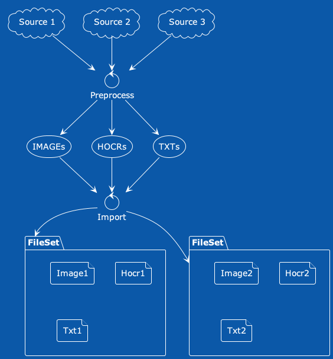
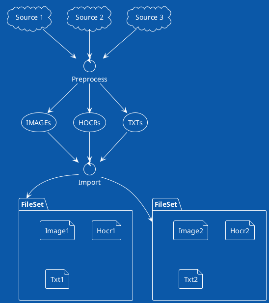
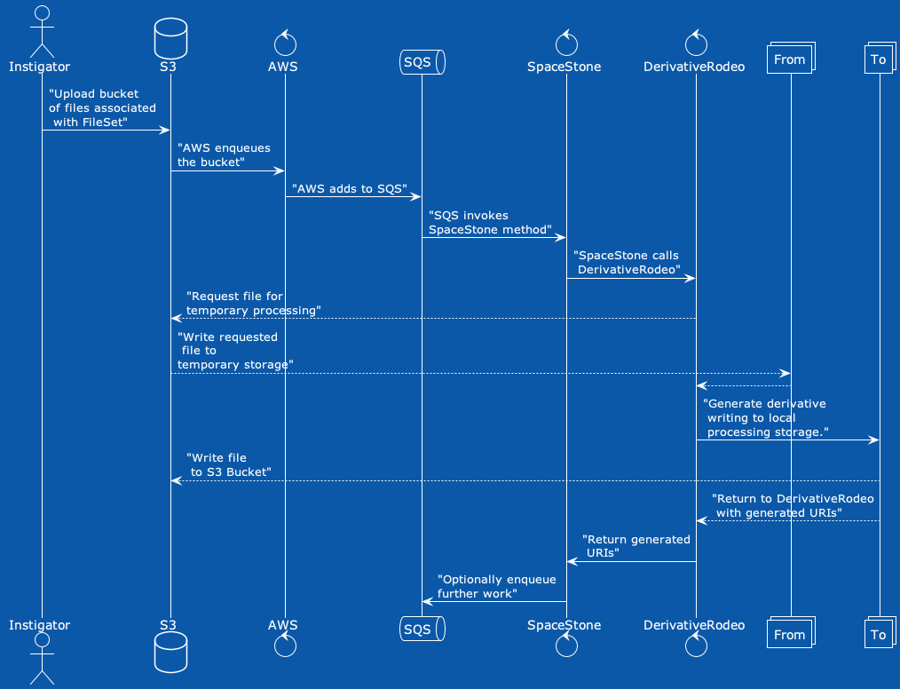
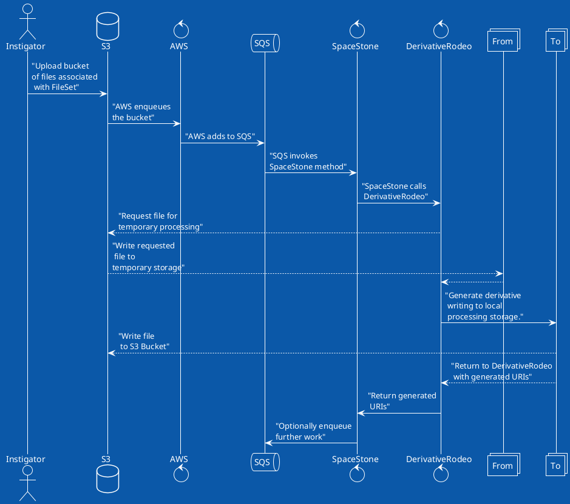

<!-- START doctoc generated TOC please keep comment here to allow auto update -->
<!-- DON'T EDIT THIS SECTION, INSTEAD RE-RUN doctoc TO UPDATE -->
**Table of Contents**  *generated with [DocToc](https://github.com/thlorenz/doctoc)*

- [DerivativeRodeo](#derivativerodeo)
  - [Process Life Cycle](#process-life-cycle)
  - [Concepts](#concepts)
    - [Common Storage](#common-storage)
    - [Related Files](#related-files)
    - [Sequence Diagram](#sequence-diagram)
  - [Installation](#installation)
  - [Usage](#usage)
  - [Technical Overview of the DerivativeRodeo](#technical-overview-of-the-derivativerodeo)
    - [Generators](#generators)
      - [Interface(s)](#interfaces)
      - [Supported Generators](#supported-generators)
      - [Registered Generators](#registered-generators)
    - [Storage Targets](#storage-targets)
      - [Supported Storage Targets](#supported-storage-targets)
  - [Development](#development)
    - [Logging in Test Environment](#logging-in-test-environment)
  - [Contributing](#contributing)

<!-- END doctoc generated TOC please keep comment here to allow auto update -->

# DerivativeRodeo

“This ain’t my first rodeo.” (an idiomatic American slang for “I’m prepared for what comes next.”)

The `DerivativeRodeo` "moves" files from one storage target (e.g. *input*) to one or more storage targets (e.g. *output*) via a generator.

- [Storage Target](./lib/derivative_rodeo/storage_targets/base_target.rb) :: where we can expect to find a file.
- [Generator](./lib/derivative_rodeo/generators/base_generator.rb) :: a process to transform a file into another file.

## Process Life Cycle

In the case of a *input* storage target, we expect that the underlying file pointed at by the *input* storage target exists.  After all we can't move what we don't have.

In the case of a *output* storage target, we expect that the underlying file will exist after the generator has completed.  The *output* storage target *could* already exist or we might need to generate the file for the *output* target.

During the generator's process, we need to have a working copy of both the *input* and *output* file.  This is done by creating a temporary file.

In the case of the *input*, the creation of that temporary file involves getting the file from the *input* storage target.  In the case of the *output*, we create a temporary file that the *output* storage target then knows how to move to the resulting place.


The above Storage Lifecycle diagram is as follows: `input target` to `input tmp file` to `generator` to `output tmp file` to `output target`.

*Note:* We've designed and implemented the data life cycle to automatically clean-up the temporary files as the generator completes.  In this way we can use the smallest working space possible.  A design decision that helps run `DerivativeRodeo` within distributed clusters (e.g. AWS Serverless).

## Concepts



<details>
<summary>The PlantUML Text for the Overview Diagram</summary>



</details>

### Common Storage

In this case, <dfn>common storage</dfn> could mean the storage where we're writing all pre-processing of files.  Or it could mean the storage where we're writing for application access (e.g. [Fedora Commons](https://fedora.lyrasis.org) for a [Hyrax](https://github.com/samvera/hyrax) application).

In other words, the `DerivativeRodeo` is part of moving files from one location to another, and ensuring that at each step we have all of the expected files we want.

### Related Files

This is not strictly related to <dfn>Hyrax's FileSet</dfn>, that is a set of files in which one is considered the original and all others are _derivatives_ of the original.

However it is helpful to think in those terms; files that have a significant relation to each other; one derived from the other.  For example an original PDF and it's extracted text would be two significantly related files.

### Sequence Diagram



<details>
<summary>The PlantUML Text for the Sequence Diagram</summary>


</details>

Given a single original file in a previous home, we are copying that original file (and derivatives) to various locations:

- From previous home to S3.
- From S3 to local temporary storage (for processing).
- Create a derivative temporary file based on existing file.
- Copying derivative temporary file to S3.

## Installation

Add this line to your application's Gemfile:

```ruby
gem 'derivative_rodeo'
```

And then execute: `$ bundle install`

Be aware that you need `pdfinfo` command line tool installed for this gem to run specs or when using PDF functionality.

## Usage

TODO: Write usage instructions here

## Technical Overview of the DerivativeRodeo

### Generators

Generators are responsible for ensuring that we have the file associated with the generator.  For example, the [HocrGenerator](./lib/derivative_rodeo/generators/hocr_generator.rb) is responsible for ensuring that we have the `.hocr` file in the expected desired storage location.

#### Interface(s)

Generators must have an initializer and build command:

- `.new(array_of_file_urls, output_target_template, preprocessed_target_template)`
- `#generated_files` (executes the generators actions) and returns array of files
- `#generated_uris` (executes the generators actions) and returns array of output uris

#### Supported Generators

Below is the current list of generators.

- [HocrGenerator](./lib/derivative_rodeo/generators/hocr_generator.rb) :: generated tesseract files from images, also creates monocrhome files as a prestep
- [MonochromeGenerator](./lib/derivative_rodeo/generators/monochrome_generator.rb) :: converts images to monochrome
- [CopyGenerator](./lib/derivative_rodeo/generators/copy_generator.rb) :: sends a set of uris to another location. For example from <abbr title="Simple Storage Service">S3</abbr> to <abbr title="Simple Queue Service">SQS</abbr> or from filesystem to S3.
- [PdfSplitGenerator](./lib/derivative_rodeo/generators/pdf_split_generator.rb) :: split a PDF into one image per page
- [WordCoordinatesGenerator](./lib/derivative_rodeo/generators/word_coordinates_generator.rb) :: create a JSON file representing the words and coordinates (derived from the `.hocr` file).

#### Registered Generators

TODO: We want to expose a list of registered generators

### Storage Targets

Storage targets are where we put things.  Each target has a specific implementation but is expected to inherit from the  [DerivativeRodeo::StorageTarget::BaseTarget](./lib/derivative_rodeo/storage_adapters/base_adapter.rb).

`DerivativeRodeo::StorageTarget::BaseTarget.targets` method tracks the registered targets.

The target represents where the file *should* be.

#### Supported Storage Targets

Storage targets follow a [URI pattern](https://en.wikipedia.org/wiki/Uniform_Resource_Identifier#Example_URIs)

- `file://` :: “local” file system storage
- `s3://` :: <abbr title="Amazon Web Service">AWS</abbr>’s <abbr title="Simple Storage Service">S3</abbr> storage system
- `sqs://` :: <abbr title="Amazon Web Service">AWS</abbr>’s <abbr title="Simple Queue Service">SQS</abbr>

## Development

- Checkout the repository: `git clone https://github.com/scientist-softserv/derivative_rodeo`
- Install dependencies: `cd derivative_rodeo; bundle install`
- Install git hooks: `rake install_hooks`
- Install binaries:
  - `pdfinfo`: provided by poppler (e.g. `brew install poppler`)
  - GhostScript (e.g. `gs`): run `brew install gs`

Then go about writing your code and documentation.

The git hooks call `rake default` which will:

- Amend the table of contents of this file
- Run `rubocop`
- Validate yard documentation (see http://rubydoc.info/gems/yard/file/docs/Tags.md#List_of_Available_Tags for help correcting warnings)
- Run `rspec` with `simplecov`

### Logging in Test Environment

Throughout the `DerivativeRodeo` we log some activity.  In the typical test run, the logs are overly chatty.  If you want the more chatty logs run the following: `DEBUG=t rspec`.

## Contributing

Bug reports and pull requests are welcome on GitHub at https://github.com/scientist-softserv/derivative_rodeo.
